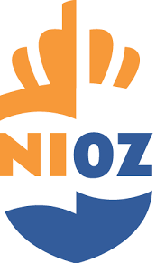

# NIOZ Project




## Inhoudsopgave
- [Vereisten](#vereisten)
- [Installatie](#installatie)
- [Configuratie](#configuratie)
- [Project starten](#project-starten)
- [Figma design](#figma-design)
---

### Vereisten

Voordat je begint, zorg dat je de volgende onderdelen hebt geïnstalleerd op je machine:

- **Python 3.8+**: [Python Installatiegids](https://www.python.org/downloads/)
- **Django 3.2+**: Geïnstalleerd via pip (zie details hieronder)
- **pip**: Python package installer


#### pip installeren:

Open de command prompt en plak:
```bash
curl https://bootstrap.pypa.io/get-pip.py -o get-pip.py
```
Daarna dit:
```bash
python get-pip.py
```

### Installatie

1. **Clone de repository**:
    ```bash
    git clone https://github.com/horizoncollege/fieldlab-project-1-programmeurs
    cd fieldlab-project-1-programmeurs
    ```

2. **Maak een virtuele omgeving aan** (aanbevolen):
    ```bash
    python -m venv env
    env\Scripts\activate
    ```

3. **Installeer de vereiste packages**:
    ```bash
    pip install -r NIOZ/requirements.txt
    ```

### Configuratie

1. **Database configuratie**:

    nioz/nioz/settings.py
    ```python
    DATABASES = {
    'default': {
        'ENGINE': 'django.db.backends.mysql',
        'NAME': 'nioz',  # De naam van je database
        'USER': 'root',  # De MySQL-gebruiker
        'PASSWORD': '',  # Het wachtwoord voor de MySQL-gebruiker
        'HOST': 'localhost',  # Of het IP-adres van je MySQL-server
        'PORT': '',  # De poort voor je MySQL-server (standaard is 3306)
    }
    ```

2. **Voer migraties uit**:
    ```bash
    python manage.py makemigrations
    ```
    **Daarna:**
    ```bash
    python manage.py migrate
    ```

### Project starten

Om de Django-ontwikkelserver te starten, voer je het volgende uit:
```bash
python manage.py runserver
```

Bezoek http://127.0.0.1:8000/ in je webbrowser om het project te bekijken.<br><br><br><br><br>
